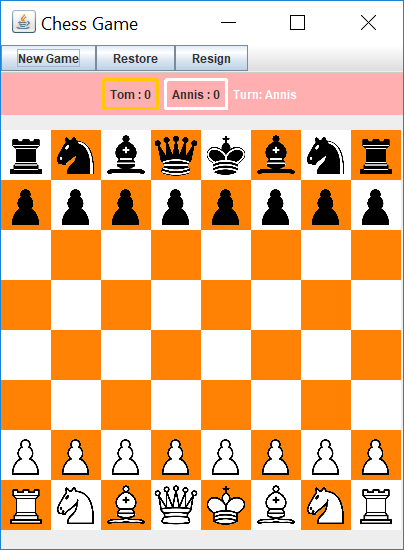

# Chess Game

Chess Game Designed for CS 242 Assignment 1

# Manual Test

## Start the Game:
* Run start.java to initialize the game.

## Initial window:
* Check if a chess game info panel pops up to collect information.
* If user do not enter name, player name will be automatically generated.
* If the user select to include special pieces, then the game will include special pieces.
* If users choose to name themselves, the black player's name and white player's name should match the corresponding names once the game starts.
* Once the user selects "Start" button, the info panel will disappear and the actual game panel shall appear.

## Actual Game View:

### 1. Check "New Game" Button:
* Check to see if the game is reset-up.
* Check if the score is correct, if there was no winner in previous game round, the score should not change.
* Check if it is still white player goes first.
* Check if the there still are special pieces if user choose to include those at the very beginning.

### 2. Check "Restore" Button:  
* Check to make sure after undo, player's turn is correct.
* For Pawn's undo, if the previous turn is its first move, after undo, each pawn has the option to move forward one space or two spaces.
* If there was a piece captured, check the captured piece get back to position.
* Check position of all pieces are correct.
* When press "New Game" button, the "Restore" button still works.

### 3. Check "Resign" Button:
* If game is already over, player cannot resign.
* Click resign button multiple times should not increase the corresponding player's score multiple times. 
* Check when clicking resign button, correct player's score is increased by the correct amount (by 1).
* After a player hit resign, they have to both agree to start the new game by pressing New Game button.
* When press "New Game" button, the "Resign" button still works.

### 4. Game Flow:
* Check the overall game flow is smooth.
* When make a selection, check if it is indeed the current player's turn.   
* If current player make a wrong selection, check if the prompt message make sense.
* Check if the target tiles change color when select a piece that the player wants to move.
* Check if the turns are alternating between black(orange color) and white player.
* Check checkmate condition if it is reached, check checkmate message prompt.
* Check stalemate condition if it is reached, check stalemate message prompt.
* Check end-game condition once a player is in checkmate and he/she has no valid movement/action to take.
